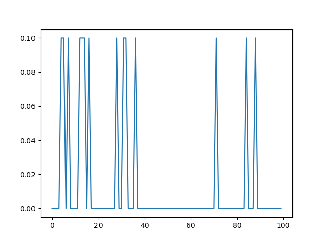
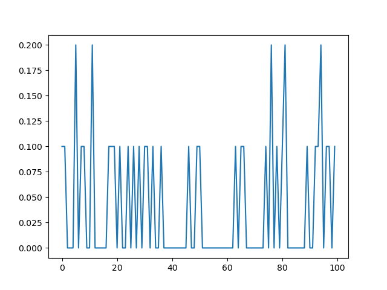
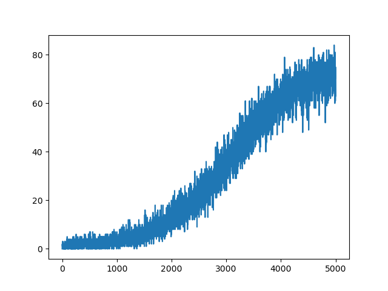

# Frozen Lake with different RL approaches

## Approach 1: Random Agent

Random agent for each episode. We can see in the graph that this is not a very good approach as the agent does not learn anything from the states and the actions. It takes completely random actions through which it achieves success in a stochastic manner.

## Approach 2: Agent that follows some policy $\pi$(a, s)

The agent follows some policy $\pi$(a, s) which may not be optimal. We observe from the graph that this is also producing consistently sub-par results. This agent does not explore and always strictly follows the policy $\pi$(a, s).

## Approach 3: Q-Learning way

This agent uses the bellman optimality to update something called a q-table, which contains the q values associated with each state and action. It is a form of TD learning through which the more the algorithm runs the more it learns. You can see in the graph that the agent's performance steadily increases over time eventhough it is fluctuating.

